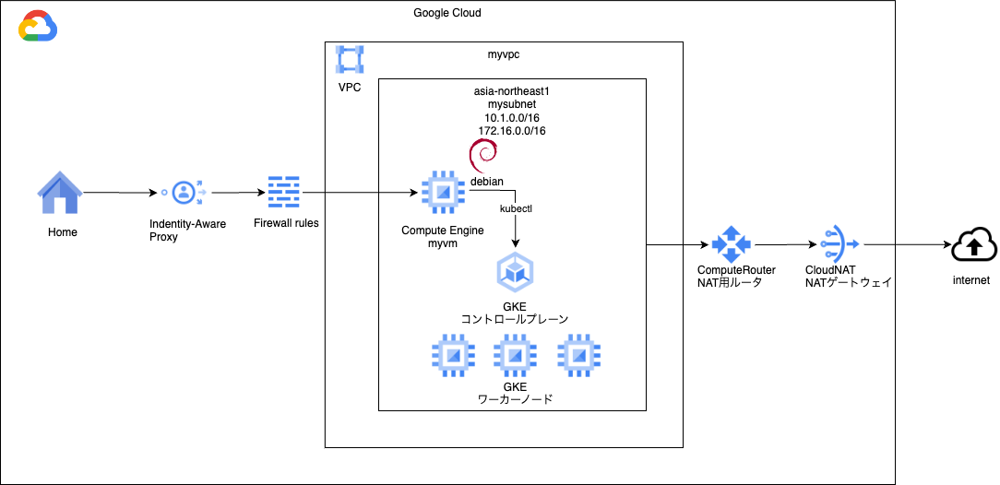

# GKE

### 1. 前提条件
05_modulesが完了していること。

### 2. 今回の構成図
GKEクラスタを構築する。<br>


### 3. 今回のコード
#### 3-1. フォルダ構成
gkeモジュールを作成する。<br>
```
06_gke/
  main.tf
  variables.tf
  provider.tf
    modules/
      network/
        main.tf
        variables.tf
        output.tf
      instance/
        main.tf
        variables.tf
        output.tf
      gke/
        main.tf
        variables.tf
        output.tf  
```
#### 3-2. gkeモジュール
GKEクラスタ本体（コントロールプレーンとワーカノード）を作成します。<br>
modules/gke/フォルダ配下に、下記の内容を記載します。<br>
```
[main.tf]
# Service account for GKE Cluster node
resource "google_service_account" "mysagke" {
  account_id   = "mysagke" 
  display_name = "GKE service account"
}

# add roles（countとリストアクセスを活用）
# 後続で利用するときに設定する。

# GKE cluster(Standard)
resource "google_container_cluster" "mygke-cluster" {
  name     = "mygkecluster"
  location = var.region

  remove_default_node_pool = true
  initial_node_count       = 1

  release_channel {
    channel = "STABLE"
  }

  network    = var.myvpc_self_link
  subnetwork = var.mysubnet_self_link

  deletion_protection=false

}

# GKE nodepool
resource "google_container_node_pool" "mygke-node-pool" {
  name       = "mygkenodepool"
  location   = var.region
  cluster    = google_container_cluster.mygke-cluster.name
  node_count = 1

  autoscaling {
    min_node_count = 1
    max_node_count = 1
  }

  upgrade_settings {
    max_surge       = 1
    max_unavailable = 0
  }

  management {
    auto_repair  = true
    auto_upgrade = true
  }

  node_config {
    machine_type = var.machine_type
    service_account = google_service_account.mysagke.email
    oauth_scopes    = [
      "https://www.googleapis.com/auth/cloud-platform"
    ]
  }
  depends_on = [google_container_cluster.mygke-cluster]
}

[variables.tf]
variable "region" {
  type    = string
  description = "The region for the VPC."
}

variable "zone" {
  type    = string
  description = "The zone for the VM."
}

variable "myvpc_self_link" {
  type    = string
  description = "My VPC SelfLink."
}

variable "mysubnet_self_link" {
  type    = string
  description = "My VPC Subnet SelfLink."
}

variable "machine_type" {
  type    = string
  description = "The GKE nodepool machine type."
  default = "e2-medium"
}
```
#### 3-3. instanceモジュール
instanceは踏み台サーバとなり、kubectlコマンドを発行できるようにします。<br>
このあとで、CICDパイプラインも作成するので、運用作業や確認作業のために利用します。<br>
そのためにサービスアカウントにロールを付与します。（元々後回しとコメントしてあったところです）<br>
modules/instance/フォルダ配下に、下記の内容を記載します。
```
[main.tf](追記)
# add roles（countとリストアクセスを活用）
resource "google_project_iam_member" "sa_gke_user" {
  count   = "${length(var.sample_app_roles)}"
  project = var.project_id
  role    = "${element(var.sample_app_roles, count.index)}"
  member  = "serviceAccount:${google_service_account.my-ope-sa.email}"
  depends_on = [google_service_account.my-ope-sa]
}

[variables.tf](追記)
variable "project_id" {
  type    = string
  description = "Project ID"
}
variable "myvmsa_roles" {
  type    = list(string)
  description = "My VM Service Account Roles."
  default = [
    "roles/container.admin",
  ]
}
```
#### 3-4. networkモジュール
GKEクラスタにVPCのセルフリンクを与えるために、outputファイルに定義を追加します。<br>
modules/networkフォルダ配下に、下記の内容を記載します。<br>
```
[output.tf](追記)
output "myvpc_selflink" {
    value = google_compute_network.myvpc.self_link
    description = "value of myvpc self link"
}
```
#### 3-5. ルートモジュール
ルートのmain.tfに下記を追加する。
```
module "gke" {

  source = "./modules/gke"

  region = var.region
  zone = var.zone
  myvpc_self_link = module.network.myvpc_selflink
  mysubnet_self_link = module.network.mysubnet_selflink
}
```

### 4. 動作確認
GKEクラスタの立ち上げを含むため、15分程度かかります。<br>
完了後は、myvmにIAPで接続します。<br>
その後、下記の手順に沿って、kubectlをインストールします。<br>
https://cloud.google.com/kubernetes-engine/docs/how-to/cluster-access-for-kubectl?hl=ja#apt<br>

下記のコマンドでクラスタの認証をします。
```
myvm:~$ gcloud container clusters get-credentials mygkecluster \
    --region=asia-northeast1
```
その後、kubectlコマンドで今回作ったクラスタの情報を参照してみます。
```
myvm:~$ kubectl get nodes
NAME                                           STATUS   ROLES    AGE   VERSION
gke-mygkecluster-mygkenodepool-63c2c88e-wk4z   Ready    <none>   27m   v1.27.11-gke.1062001
gke-mygkecluster-mygkenodepool-b64973d4-z83h   Ready    <none>   27m   v1.27.11-gke.1062001
gke-mygkecluster-mygkenodepool-c866f6e1-5rfg   Ready    <none>   27m   v1.27.11-gke.1062001

myvm:~$ kubectl get pods
No resources found in default namespace.
```
エラーなく実行できればOK。

### 5. 次回予告
これでGKEクラスタを構築できるようになり、VMからコマンドでの操作が可能になりました。<br>
次回は、CICDパイプラインを作り、今回作ったGKEクラスタへのアプリケーションデプロイを自動化します。<br>
(Kubernetes/コンテナは、Terraformがひと段落したら実施予定。)


