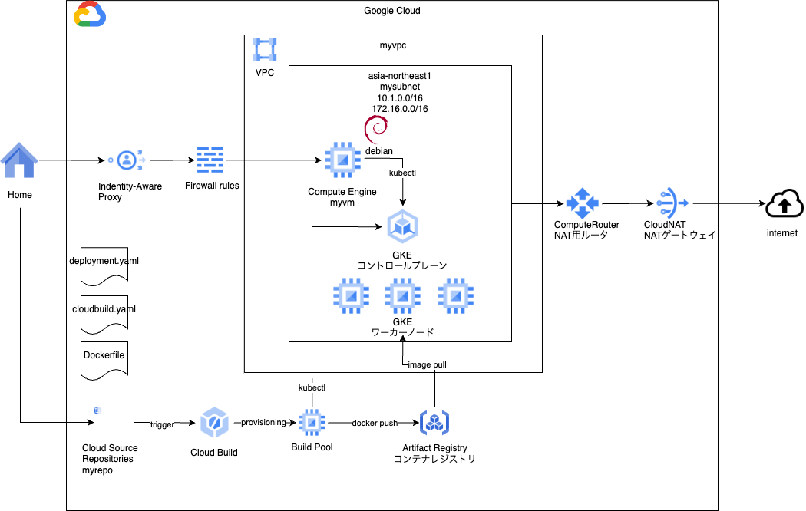
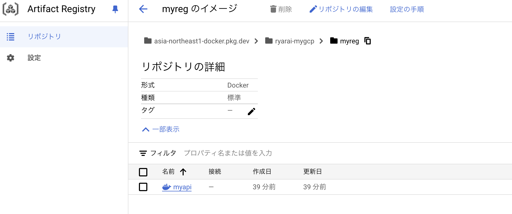

# kubernetes 2

### 1. 前提条件
18_kubernetesが完了していること。

### 2. 今回の構成図
07_cicdと同じ構成とします。


### 3. 準備
下記のように、NW、インスタンス、GKEのモジュールを実行します。
```
module "network" {

  source = "./modules/network"

  region = var.region
  zone = var.zone
  vm_tags = var.vm_tags

}

module "instance" {

  source = "./modules/instance"

  region = var.region
  zone = var.zone
  vm_tags = var.vm_tags
  project_id = var.project_id
  mysubnet_self_link = module.network.mysubnet_selflink
}

module "gke" {

  source = "./modules/gke"

  region = var.region
  zone = var.zone
  myvpc_self_link = module.network.myvpc_selflink
  project_id = var.project_id
  mysubnet_self_link = module.network.mysubnet_selflink
}

module "cicd" {

  source = "./modules/cicd"

  region = var.region
  project_id = var.project_id
}

```
完了したら、06_gkeの4. 動作確認と同じく、VMからGKEに接続できるところまで確認をお願いします。<br>
[06_gkeの4.動作確認](https://github.com/ryarai-pbgit/myterraform/tree/main/docs/06_gke#4-%E5%8B%95%E4%BD%9C%E7%A2%BA%E8%AA%8D)

（apt版でコマンドだけ記載しておきます。）
```
$ grep -rhE ^deb /etc/apt/sources.list* | grep "cloud-sdk"
$ sudo apt-get update
$ sudo apt-get install -y kubectl
$ kubectl version --client
$ apt-get install google-cloud-sdk-gke-gcloud-auth-plugin
$ gke-gcloud-auth-plugin --version
$ gcloud container clusters get-credentials mygkecluster --region=asia-northeast1
$ kubectl get namespaces
```

### 4. 自作APIのデプロイ
16_dockerで作成したFastAPIのコンテナをArtifactRegistryにアップロードします。<br>
ビルドするときにタグを下記のように設定します。
```
# ルール
[region]-docker.pkg.dev/[project_id]/myreg/myapi:v001
# 実際の例
asia-northeast1-docker.pkg.dev/[YOUR_PROJECT_ID]/myreg/myapi:v001
```
なお、Macでビルドしている場合は、M系チップとGKE側のCPUチップセットの互換性の問題があり、この後Podをデプロイした際にエラーになる可能性があります。ビルド時に下記のオプションをつけて、GKE側のCPUに合わせてください。
```
--platform linux/x86_64
```
ビルドが完了したら、pushします。<br>
ローカルやクラウドシェルからGCPにpushする場合は、GCPの認証を行う必要があります。
```
# ブラウザを使った認証フローが入ります。
$ gcloud auth login

# HOSTNAME-LISTには、asia-northeast1-docker.pkg.devを指定します。
$ gcloud auth configure-docker HOSTNAME-LIST

# pushする、エラー出ないことを確認する。
$ docker push asia-northeast1-docker.pkg.dev/YOUR_PROJECT_ID/myreg/myapi:v001
```
画面でもpushできていることを確認しておきます。


次にこのAPIを手動でGKEにデプロイします。下記のようなYAMLを用意します。<br>
18_kubernetesで学んだ要素のうち、必要最小限のもの（namespace, serviceaccount, deployment, service）だけ定義しています。
```
apiVersion: v1
kind: Namespace
metadata:
  name: app
---
apiVersion: v1
kind: ServiceAccount
metadata:
  name: mypodsa
  namespace: app
---
apiVersion: v1
kind: Service
metadata:
  name: myservice
  namespace: app
spec:
  type: NodePort
  selector:
    app: demoapp
  ports:
  - protocol: TCP
    port: 80
    targetPort: 80
---
apiVersion: apps/v1
kind: Deployment
metadata:
  name: demoapp
  namespace: app
  labels:
    app: demoapp
spec:
  replicas: 1
  selector:
    matchLabels:
      app: demoapp
  template:
    metadata:
      labels:
        app: demoapp
    spec:
      serviceAccountName: mypodsa
      containers:
      - name: demoapp
        image: asia-northeast1-docker.pkg.dev/YOUR_PROJECT_ID/myreg/myapi:v001
        ports:
        - containerPort: 80
```
作ったVMにこのファイルを配置し、下記のコマンドを発行します。（ファイル名は、deployment.yamlとしています）
```
myvm:~$ kubectl apply -f deployment.yaml 
namespace/app created
serviceaccount/mypodsa created
service/myservice created
deployment.apps/demoapp created
```
完了したらPodが立ち上がったことを確認します。RUNNINGになっていればOKです。
```
myvm:~$ kubectl get pods -n app
NAME                       READY   STATUS    RESTARTS   AGE
demoapp-5d548f4544-qd2pd   1/1     Running   0          32s
```
エラーになったりしている場合は、describeやlogsのコマンドを利用して原因の切り分けを行います。<br>
自分なりにやってみて、難しければご連絡ください。立ち止まって欲しいポイントではないので。<br>

最後にVMから接続確認を行います。<br>
サービスのNodePortタイプは、IPアドレスがノードのIPのいずれか、ポート番号はNodePortで自動で割り当てられた番号（指定して固定することも可能）で疎通できます。<br>
まず、IPアドレスを調べます。-o wideオプションで表示されます。VPC内の内部通信なのでRFC1918帯を使用します。
```
myvm:~$ kubectl get nodes -o wide
NAME                                           STATUS   ROLES    AGE     VERSION                INTERNAL-IP   EXTERNAL-IP      OS-IMAGE                             KERNEL-VERSION   CONTAINER-RUNTIME
gke-mygkecluster-mygkenodepool-512e6721-37zn   Ready    <none>   5h24m   v1.27.11-gke.1062003   10.1.0.9      34.84.162.87     Container-Optimized OS from Google   5.15.146+        containerd://1.7.10
gke-mygkecluster-mygkenodepool-92231d68-vsvp   Ready    <none>   5h24m   v1.27.11-gke.1062003   10.1.0.8      35.194.119.151   Container-Optimized OS from Google   5.15.146+        containerd://1.7.10
gke-mygkecluster-mygkenodepool-ca3e605d-dw92   Ready    <none>   5h24m   v1.27.11-gke.1062003   10.1.0.7      34.84.75.110     Container-Optimized OS from Google   5.15.146+        containerd://1.7.10
```
（10.1.0.7と記録。。）
ポート番号は、serviceから取得します。
```
myvm:~$ kubectl get svc -n app
NAME        TYPE       CLUSTER-IP       EXTERNAL-IP   PORT(S)        AGE
myservice   NodePort   10.183.238.203   <none>        80:31675/TCP   27m
```
（31675と記録。。）
疎通を試みます。
```
myvm:~$ curl http://10.1.0.7:31675/
{"Hello":"World"}
```
お疲れ様でした。<br>
（destroyすればPodも含めて全部消えます）

### 5. 次回予告
（この時点でも任意のpython Fast APIをGKE上にデプロイして利用することが可能ですが）<br>
今回はkubernetes操作に慣れるため手動運用しました。次回はCICDパイプラインに載せて同じことを行います。<br>
